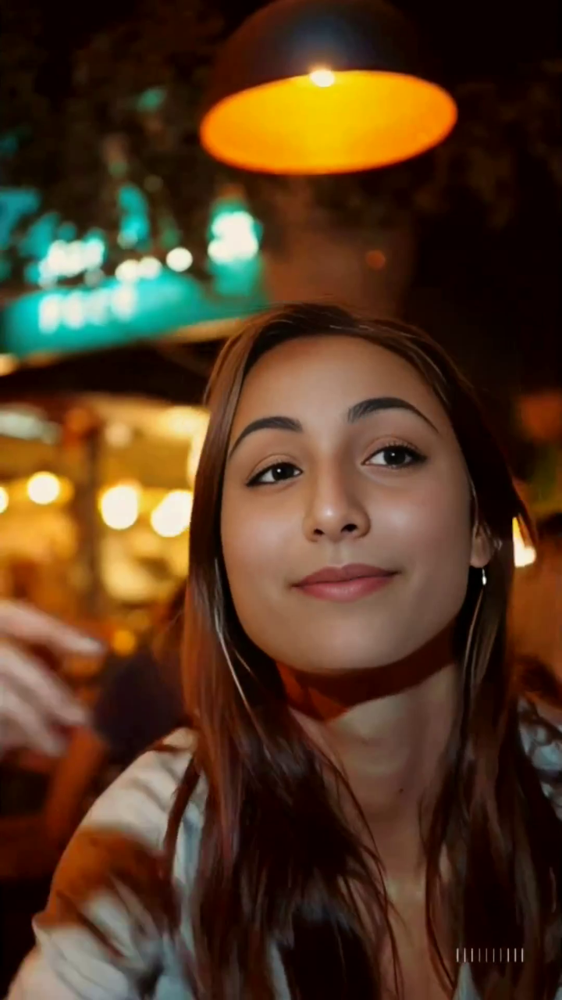
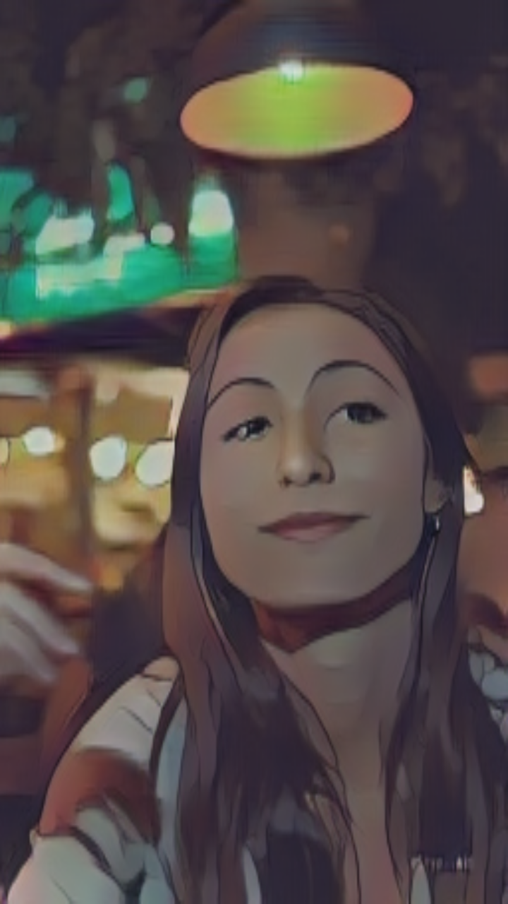

<p align="center">
  <a href="https://bit-scripts.github.io/"><strong>🔗 Site officiel : bit-scripts.github.io</strong></a>
</p>

<p align="center">
  
  
  
  
</p>

# Ghibli Style Transfer with AnimeGANv2 🧠🎨

Ce projet permet d'appliquer un **style Ghibli animé** à des vidéos ou images, en utilisant les modèles de **AnimeGANv2** convertis au format **ONNX**, optimisés pour des machines avec GPU **AMD + ROCm**.

---

## 🚀 Fonctionnalités

- ✅ Support des modèles ONNX ou TensorFlow `.pb`
- ✅ Compatible CPU + GPU (AMD via ROCm grâce à `onnxruntime`)
- ✅ Visualisation des résultats et histogrammes avec `matplotlib`
- ✅ Recomposition automatique en vidéo avec `ffmpeg`

---

## 📦 Dépendances

```bash
pip install -r requirements.txt
```

`requirements.txt` :

```makefile
numpy
opencv-python
tensorflow==1.15.0
matplotlib
tqdm
onnxruntime      # Pour CPU
# ou, si tu as un GPU AMD + ROCm :
# onnxruntime-rocm -f https://repo.radeon.com/rocm/manylinux/rocm-rel-6.3.4/
```

🔥 Si tu utilises une carte **AMD Radeon** compatible ROCm, installe `onnxruntime-rocm` :

```bash
pip uninstall onnxruntime
pip install onnxruntime-rocm -f https://repo.radeon.com/rocm/manylinux/rocm-rel-6.3.4/
```

---

## 📁 Utilisation

```bash
python ghibli_video_pipeline.py \
    --video chemin/vers/video.mp4 \
    --model models/Hayao.onnx \
    --preview \
    --clean-frames
```

---

## 📥 Cloner AnimeGANv2

Pour exporter ou convertir les modèles, commence par cloner le dépôt officiel :

```bash
git clone https://github.com/TachibanaYoshino/AnimeGANv2.git
cd AnimeGANv2
```

Tu pourras ensuite utiliser les checkpoints disponibles dans `checkpoint/`.

---

## 🧩 Conversion `.ckpt` → `.pb`

Avant de convertir un modèle vers ONNX, il faut l'exporter au format `.pb` avec le script fourni par AnimeGANv2 :

```bash
python tools/export_model.py \
    --checkpoint_dir checkpoint/AnimeGAN_Hayao \
    --export_dir output \
    --model_name generator_Hayao.pb
```

Cela génère un fichier `.pb` figé utilisable pour la conversion suivante.

---

## 🔄 Conversion `.pb` → `.onnx`

```bash
python -m tf2onnx.convert \
  --graphdef output/generator_Hayao.pb \
  --inputs test_input:0 \
  --outputs generator_1/G_MODEL/out_layer/Tanh:0 \
  --output models/Hayao.onnx \
  --opset 11
```

Pour lister les entrées et sorties d’un modèle `.pb`, utilise :

```bash
python tools/list_inputs.py
python tools/nodes_list.py
```

---

## 🧠 Modèles supportés

Tu peux utiliser tous les modèles AnimeGANv2 :

- `Hayao.onnx` — style Ghibli
- `Shinkai.onnx` — style Makoto Shinkai
- `Paprika.onnx` — style Satoshi Kon

---

## 🛠️ Scripts utiles

- `tools/list_inputs.py` → affiche les nœuds d’entrée
- `tools/nodes_list.py` → affiche les nœuds de sortie (à utiliser pour --outputs)
- `tools/export_model.py` → convertit `.ckpt` vers `.pb`
- `tools/freeze_graph.py` → script modifié pour exporter les graphes de manière compatible avec ONNX

---

## ✨ Exemple

<p align="center">
  
  
</p>

---

## 🐧 Compatibilité ROCm

Grâce à `onnxruntime`, tu peux faire tourner les modèles sur **GPU AMD** compatibles **ROCm** (Radeon Open Compute).
Cela évite la dépendance à CUDA/NVIDIA et fonctionne parfaitement sous Ubuntu.

---

## 📝 Licence
MIT — feel free to contribute under [bit-scripts](https://github.com/bit-scripts).

---

Créé avec ❤️ par un amoureux de Ghibli & de l'open source

